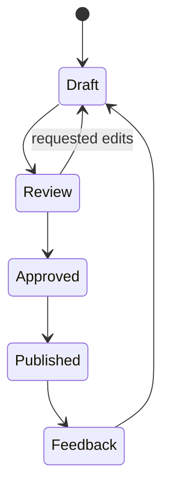

# Review and feedback flow



## Reader flags a gap

A reader leaves page feedback or a reviewer comments on a draft.


## Instructional designer applies feedback

The page owner updates language, visuals or structure.


## Product team approves

A reviewer validates the technical accuracy before publishing.


