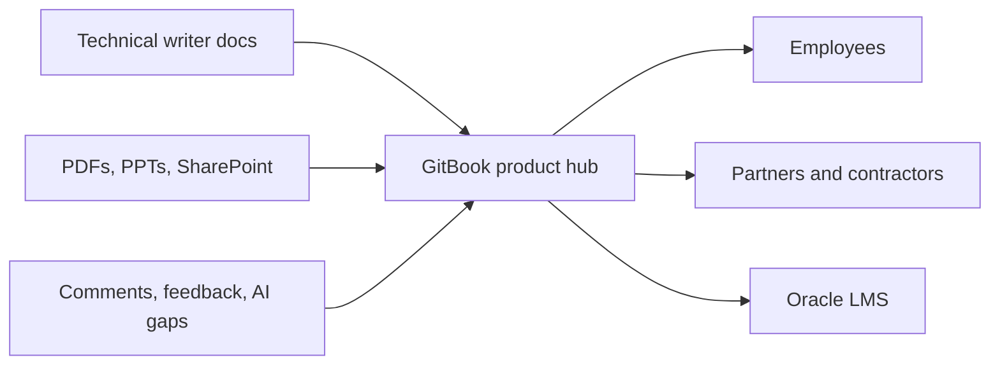

# Why this layer

| System | Good at | GitBook adds |
| --- | --- | --- |
| SharePoint | File storage | Curated pages and search |
| PDFs and PPTs | Formal collateral | Maintained answers with source links |
| Oracle LMS | Deep training | Pre-learning knowledge and external access |
| Product teams | Accuracy | Review comments and change requests |
