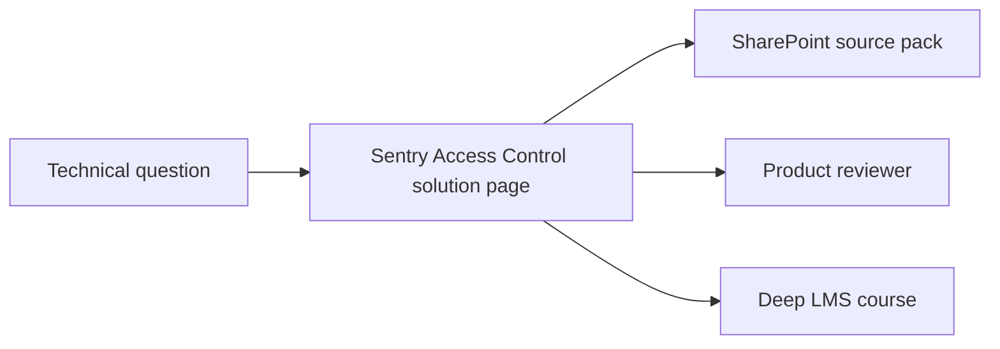

# Solution design



Main components, deployment pattern and integration owners.


Physical, security and operational assumptions that need review.


Technical writer docs, drawings and approved decks.


